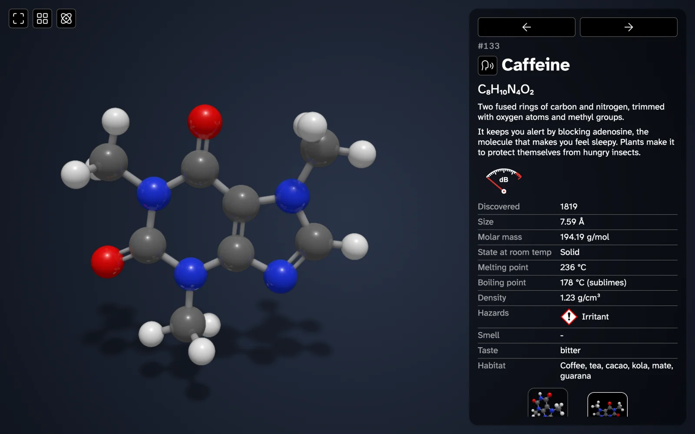
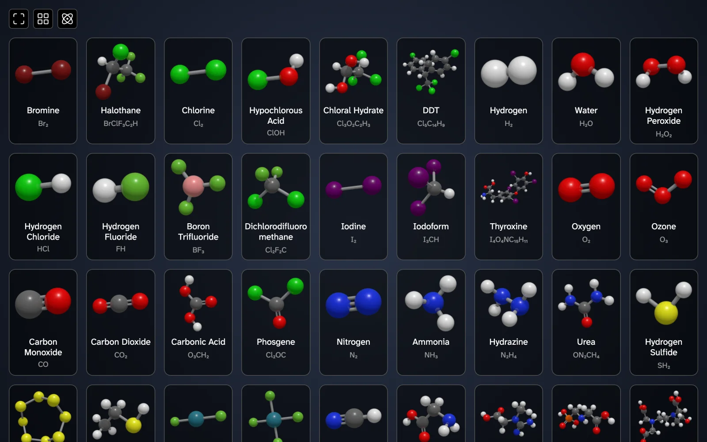
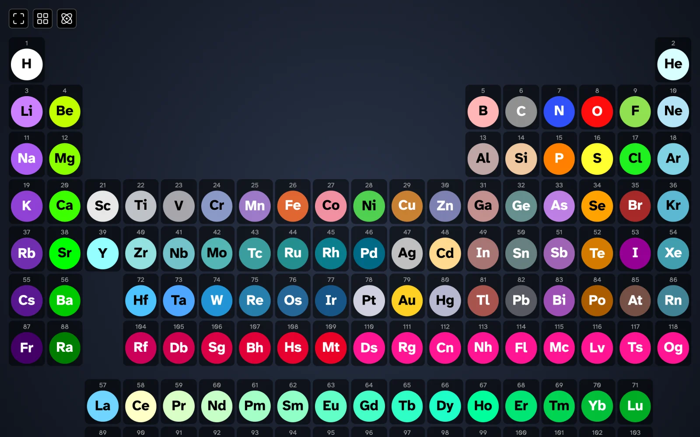
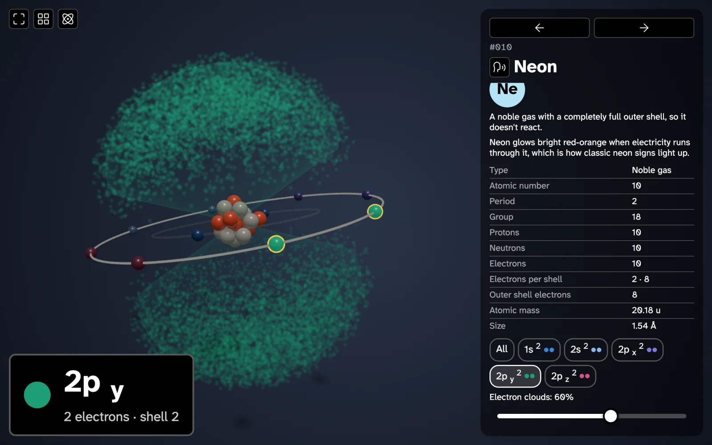

# Molecules

A kid-friendly 3D field guide to molecules and atoms.

**Try it: https://electrovir.github.io/molecules**

Spin, zoom, and tap 180 molecules, from water and oxygen to caffeine and beta-carotene. Each one has a short description, real stats (melting point, density, hazards, where it's found), a spoken pronunciation, and its own "cry": a sound shaped by the molecule's atoms, bonds, and estimated vibrations.



## Every molecule at a glance



## Periodic table



## Atoms and their electron orbitals

Each element shows its nucleus and electrons. Pick an orbital to see its electron cloud.



## Development

Requires Node.js 22 or newer.

```sh
npm ci
npm start
```

-   `npm test`: run all tests.
-   `npm run build`: build the static site into `packages/frontend/dist`.

Pushes to `dev` deploy to GitHub Pages.
